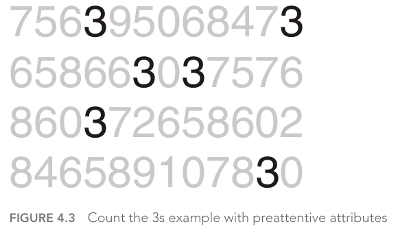
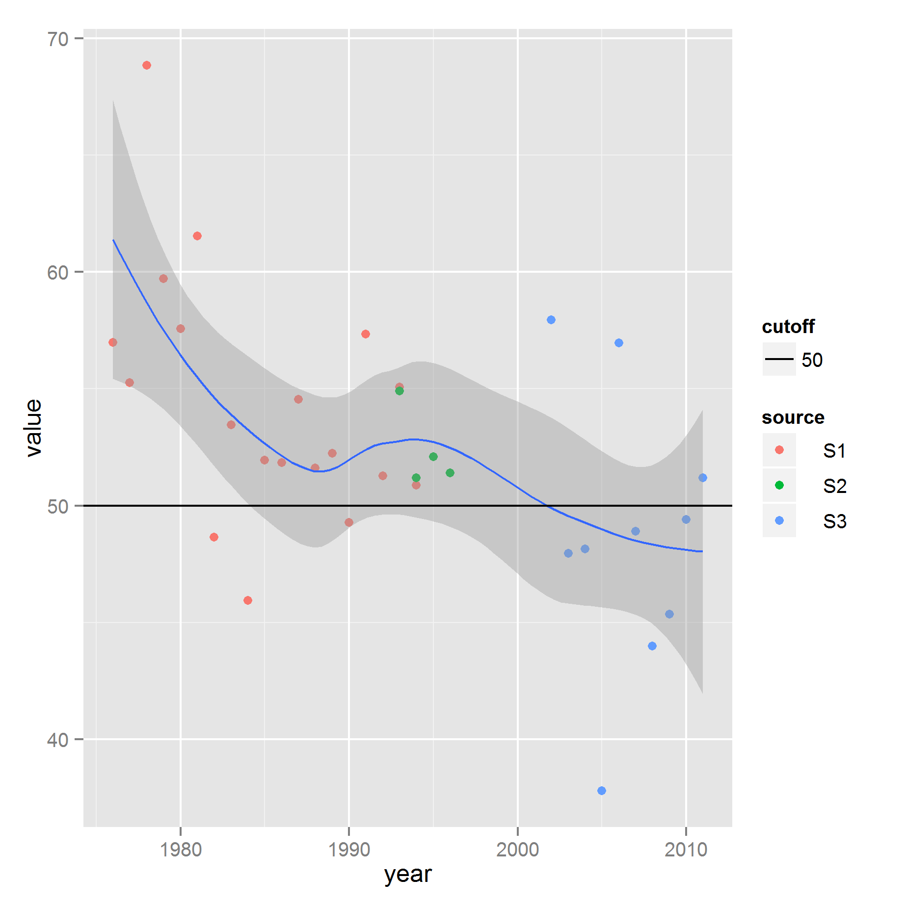

## Section outline

1. Reminder: variable types
2. Mapping variables to graphs
  - Marks
  - Channels, channel types
  - Using marks and channels
3. So, which graph?

Practice: explore dimensions, measures and graph types in Tableau

---

<figure class="fragment" style="float:right;width:600px;">
  
</figure>

<figure class="fragment" style="float:right;width:500px;clear:right;">
  
</figure>

<figure class="fragment" style="float:right;width:500px;clear:right;">
?
</figure>

{width=200}

::: notes

Dataset showing town name and amount of subsidies (funds) received in a given year. How do you think we could visualize this?

- visualization requires _mapping_ or _translation_ from _data_ to _visual language_ (idioms)
- this can be done in many ways

1. subsidy amount = bar height, color irrelevant
2. to show in map **transformation is required** (not possible directly)
  - color IS relevant (subsidy amount = color saturation)
  - comparison is more difficult: not _ordered_ (althoug not impossible)
  - allows for more direct insight (if context - knowledge of the area): Vitoria-Gasteiz not getting the higher amount
3. anything else? (i.e. pie chart, treemap...)

:::

## 1.1 Reminder: variable types

<b>A question of time</b>

Spatial and time/hour variables are special variable types. **Time variables** are specially complex:

- are there 365 days in every year? 30 days in every month? 24 hours in every day?
- _timezones_ make it even more complex to use hours or time of day

Time may be used as a continuous or as a qualitative variable.

- as a qualitative variable, it has a hierarchy: year > month > (week >) day > hour > minute
- but different hierarchies may be necessary: bimonthly publications, multiple work shifts in a day...

- Quantitative
    - Continuous
    - Discrete
- Qualitative
    - Categorical
    - Ordinal
- Special types
  + time
  + space
  + ...

::: notes

- continuous variables can take on infinite/uncountable values (time, real numbers)
- discrete variables can take a finite/countable number of values (periods of time, integers)

- categorical/nominal: two or more categories, any order (gender, political party...). Cannot be quantified, do not allow arithmetic operations, cannot be assigned any order
- ordinal: allows for rank order (1st, 2nd, 3rd...). Can be dichotomous (yes/no, right/wrong, sick/healthy...) or non-dichotomous (spectrum of values:  completely agree, mostly agree, mostly disagree, completely disagree)

:::

## 1.2 Mapping variables to graphs

<!--

](img/6.57.EncodingsTable_preview.png){width="650px"}

::: notes

Grafikoagoa egitea komeniko litzateke

:::

-->

Understanding **marks and channels** provides the building blocks for analyzing visual encodings (Munzner 2014, p.95)

---

### 1.2.1 Marks

A **mark** is a basic graphical element in an image

::: notes

- a zero-dimensional (0D) mark is a point
- a one-dimensional (1D) mark is a line
- a two-dimensional (2D) mark is an area
- a three-dimensional (3D) mark is possible but not frequently used (will see why)

:::

---

### 1.2.2 Channels

A visual **channel** is a way to control the appearance of marks

{width=500}

::: notes

- spatial position (_where_)
- color, with three distinct aspects: hue, saturation, luminance (more in the next slide)
- size, one for each added dimension: length 1D, area 2D, volume 3D
- angle/tilt/slope
- others are shape, curvature

:::

---

### 1.2.2 Channels

**One and only one** attribute/variable should be used per channel.

Multiple channels per attribute are possible (**redundant encoding**), but this approach has limitations.

::: notes

more channels are "used up", so less attributes can be encoded in total, 

BUT the attributes that are shown will be very easily perceived (i.e. color of political party for bar charts)

:::

---

### 1.2.2 Channels

The **size** and **shape** channels cannot be used on all types of marks, but most combinations are still possible:

- lines have two _size channels_: length + width
- points refer to location but can be _size_ and _shape_ coded

::: notes

Area marks cannot typically be size or shape coded: state or country already has a certain size and shape

- lines: if length is _taken_ by a variable, it can't be used for another one, but width can be used to size code. They can be made wider on an individual basis to encode an additional attribute, or an entire set of bars can simply be made wider in a uniform way to be more visible
- points: intrinsically convey information only about position and are exactly the vehicle for conveying additional information through area and shape (and color!)

:::

---

### 1.2.3 Channel types

Two kinds of sensory modalities:

1. **Identity**: what, where
2. **Magnitude**: how much

It does not make sense to ask magnitude questions for shape, color hue. We can ask about magnitudes with length, area or volume; color luminance or saturation; and angle/tilt/slope.

::: notes

>The human perceptual system has two fundamentally different kinds of sensory modalities. The **identity** channels tell us information about _what_ something is or _where_ it is. In contrast, the **magnitude** channels tell us _how much_ of something there is (Munzner 2014, p.99).

:::

---

### 1.2.4 Using marks and channels

All channels are not equal.

The selection of marks and channels should be guided by the principles of **expressivenes** and **effectiveness**.

Once the most important attributes/variables for the desired insight have been identified, the selection of marks and channels should ensure that they are **encoded with the highest ranked**.

::: notes

>the same data attribute encoded with two different visual channels will result in different information content in our heads after it has passed through the perceptual and cognitive processing pathways of the human visual system (Munzner 2014, p.100)

- expresiveness: the visual encoding should express all of, and only, the information in the dataset attributes. Ordered data should be shown in a way that we perceive as ordered; unordered data SHOULD NOT be shown in a way that implies an ordering that does not exist.
- effectiveness: the importance of the channel (task abstraction, targets and actions) should match its salience, how noticeable it is. The most important attributes/variables should be encoded with the most effective channels, and less important attributes can be matched with less effective channels.

These can be combined to create a ranking of channels according to the type of data that is being visually encoded. 

:::

---

### 1.2.4 Using marks and channels

{width=600}

::: notes

Channels related to spatial position are at the top of both lists, and they are the only ones appearing on both lists (none of the others are effective for both data types). This primacy applies only to 2D positions, 3D depth is a much lower-ranked channel

:::

---

### 1.2.4 Using marks and channels

The choice of **which attributes/variables to encode with position** is the most central choice in visual encoding.

::: notes

the attributes encoded with position will dominate the user's mental model --their internal mental representation used for thinking and reasoning-- compared with those encoded with any other visual channel. 

:::

---

### 1.2.4 Using marks and channels

{width=600}

::: notes

Perceptual accuracy of each channel type: how accurate is the interpretation made by users depending on the type of channel used to represent certain data

:::

## 1.3 So, which graph?

. Interactive version: [Chart chooser](http://labs.juiceanalytics.com/chartchooser/index.html)](img/choosing-chart.png){width=600}

::: notes

Variable types and insights (Munzner's "targets") as *ingredients*, which *recipes* can be used to *cook* data visualization?

There are many tools for this, represented only one. 

<!--
[The Data Visualisation Catalogue](https://datavizcatalogue.com/search.html)
-->
:::

## Tableau: let's explore

<!-- {width=700} -->

- Dimensions and measures (remember also blue _vs._ green)
- Encode = drag
- `Show me` tab

::: notes

Left column, `Data` tab: 

- dimensions contain qualitative values
- measures contain numeric, quantitative values (you can apply calculations to them and aggregate them)

Reminder (blue _vs._ green, [learn more](http://onlinehelp.tableau.com/current/pro/desktop/en-us/help.html#datafields_typesandroles.html?Highlight=dimensions%20measures)):

- green = continuous. Its values are treated as an infinite range. Generally, continuous fields add axes to the view.
- blue = discrete. Its values are treated as finite. Generally, discrete fields add headers to the view. 

Mapping variables to graphs is done, in Tableau, by dragging items from the left column to either: `Columns`/`Rows`, or `Marks`.

`Show me` tab displays the most common graphs and the minimum requirement of data for each graph. If graphs = recipes, lets us know which ingredients are required to cook a certain recipe.

Also works the other way round: if I select my ingredients from the left bar, the `Show me` tab highlights the recipes available for those ingredients.

(test some graphs)
- Source only > table
- add spent > table, pie chart etc

<!-- The # of marks in the status bar represents the number of items in the graph. Determined by the combination of dimensions:

- if no dimensions (only income), sum of everything (maximum aggregation)
- if 1 dimension (i.e. source), 1 mark for each unique value
- if +1 dimension (i.e. + quarter), cross table of no. of unique values in each dimension -->

Fields can be used more than once (redundant coding) for easier identification, by dragging to more than one place. barchart income (rows) + source (columns), source to colour

Options in `Show me` are different from the `Marks` box. Show me only allows graphs that _make sense_, very basic and tested graphs. Marks allows to _force_ graphs in case we need more complex displays. USE WITH CAUTION, possible to create graphs that make no sense or are misleading (change to "line" in Marks box)

:::

# 2. Promote insight

---

## Section outline

How can we enable easier insight through data visualization?

1. Change default settings
2. Make simpler graphs
3. Highlight observations
4. Add attributes as context
5. Add statistical information

Practice: build (not so) basic graphs

## 2.1 Change default settings {data-transition="none"}

<figure>

](img/easieranalysis1.png)

<figcaption style="margin-top:0;"></figcaption>
</figure>

::: notes

Official results form the Berlin marathons. The default aggregation from the tool used to create this visualization presents an almost perfect normal distribution.

:::

## 2.1 Change default settings {data-transition="none"}

](img/easieranalysis2.png)

::: notes

More detail (less aggregation) allows to see some highlighted bars

:::

## 2.1 Change default settings {data-transition="none"}

](img/easieranalysis3.png)

::: notes

Even more detail (less aggregation) makes those bars stand out more and new ones appear: what is happening here?

:::

## 2.1 Change default settings {data-transition="none"}

](img/easieranalysis4.png)

::: notes

vertical dashed lines show hour marks in red (3h, 4h, 5h, main goal times for marathon runners), half-hour marks in grey. People try to fit into their closest _rounded time_...

:::

## 2.2 Make simpler graphs

&nbsp;

>Data-ink is the non-erasable core of the graphic, the non-redundant ink arranged in response to variation in the numbers represented. 

<figure style="text-align:right;">
  <figcaption>
Tufte 1983
</figcaption>
</figure>

::: notes

we should remove all non-data-ink and redundant data-ink, within reason, to increase the data-ink-ratio and create a sound graphical design. 

some redundancy is often more effective, however, most graphics don't struggle with understatement. In fact, most contain a stunning amount of excess ink (or pixels). Rather than dressing our data up we should be stripping it down.

:::

## 2.2 Make simpler graphs

  <iframe src="https://speakerdeck.com/player/87bb9f00ec1e01308020727faa1f9e72" style="border: 0; top: 0; left: 0; width: 520px; height: 450px; position: absolute;" allowfullscreen scrolling="no"></iframe>

<figure>
  <figcaption>
  A step-by-step example: [Data looks better naked](http://www.darkhorseanalytics.com/blog/data-looks-better-naked)
</figcaption>
</figure>

::: notes

In it we start with a chart, similar to what we've seen in many presentations, and vastly improve it with progressive deletions and no additions.

The next time you are trying to improve a chart, consider what you can take away rather than what you can add.

:::

## 2.2 Make simpler graphs 

More on decluttering:

<figure>
<iframe width="560" height="315" src="https://www.youtube.com/embed/X79o46W5plI" frameborder="0" allow="autoplay; encrypted-media" allowfullscreen></iframe>

<figcaption style="margin-top:0;">Nussbaumer, [Declutter Your Data Visualizations](https://www.youtube.com/embed/X79o46W5plI)</figcaption>
</figure>

## 2.3 Highlight observations

Through [preattentive attributes](https://www.interaction-design.org/literature/article/preattentive-visual-properties-and-how-to-use-them-in-information-visualization):

- they are processed in spatial memory without our conscious action
- make it easier to understand what is represented through a design: saves from consciously processing data

::: notes

A preattentive visual property is one which is processed in spatial memory without our conscious action. In essence it takes less than 500 milliseconds for the eye and the brain to process a preattentive property of any image.  These properties can be harnessed to make it easier for a user to understand what is presented through the design and save them from consciously processing all the data presented in short-term memory which requires more effort.

:::

## 2.3 Highlight observations

::: notes

There are 6. No visual cues to help count. It makes this a challenging exercise, you have to hunt through the lines of text, looking for the number 3.

What happens when we make a single change to the block of numbers. Repeat the exercise of counting the number 3s.

:::

## 2.3 Highlight observations

::: notes

Note how much easier and faster the same exercise is. There is no time to blink, no time to think, no NEED to think. The preattentive attribute of intensity of color in this case, makes the number 3s stand out from the rest. Our brain is quick to pick them up without having to dedicate any conscious thought to it.

:::

## 2.3 Highlight observations

{width=650}

::: notes

your eye is drawn to the one element within each group that is different from the rest, you don't have to look for it. Our brain is hardwired to quickly pick up differences we see in the environment.

NOTE that people tend to associate quantitative values to some of the preattentive attributes (length, width, size; not colour). This tells us which of the attributes can be used to code quantitative information  (line
length, spatial position, or to a more limited extent, line width, size,
and intensity can be used to reflect relative value), and which should
be used as categorical differentiators.

:::

## 2.3 Highlight observations 

![Nussbaumber, [Do you see it? The importance of contrast when communicating with data [video]](https://www.youtube.com/watch?v=60KiAXbkrl0)](img/nussbaumer-contrast.png){width="700px"}

::: notes

After decluttering, more _channels_ are available for highlight. This allows to

1. draw your audience’s attention quickly to where you want them to look, and 
2. create a visual hierarchy of information

:::

## 2.4 Add variables (as context)

- Adding preexisting variables (in moderation)
- Creating conditional variables from preexisting variables
    - binaries or with few levels are best
    - example of calculated field or variable: weekend date

{.fragment}

::: notes

useful only if addition conveys meaning / enables insight. In the graph, the colour coding is explanatory to the left, but it is not to the right. 

:::

## 2.5 Add statistical information

<figure style="float:right;width:50%;" class="fragment">

<figcaption>
[source](https://stackoverflow.com/questions/13254441/add-a-horizontal-line-to-plot-and-legend-in-ggplot2)
</figcaption>
</figure>

- statistical summaries   (mean, variance)
- models

## Tableau: (not so) basic graphs

)](img/sparkline_d3_angular.png){width=400}

::: notes

Select Quarter and Income, line graph from Show me.

Quarter: will default to higher level of aggregation (YEAR). Possible to select different aggregations (when and if attribute is correctly interpreted): year > q > month...

When selecting aggregate levels with dates (by clicking on arrow):

- top half considers date as discrete (will change to blue if selected). Useful to compare the same period of time in different years.
- bottom half considers date as continuous.

Source to rows will draw one graph per source. 

Rename sheet to `Sparkline`, Save.

:::

## Tableau: (not so) basic graphs

)](img/bulletgraph-plain.png)

## Tableau: (not so) basic graphs {data-transition="none"}

](img/bulletgraph-annotated.png)

::: notes

Source to rows, income to columns > draws bars.

Where is goal? Drag to columns > two different graphs (not what we want).

Select source + income + goal > bullet graph from Show me.

Shows totals, may not be what we want. Anyway, what did this do? Now manually:

1. source to rows, income to columns
2. now we want goal as black bar (reference line), goal valorations as background (distribution band)
3. Double click on ref. line, adds a line of average income
  - scope: default `per pane`: avg per each _combination_. `per table`, whole table (same as per pane when there is only one dimension). `per cell` avg. per each mark.
  - line: only shows income for now. How to add goal? Drag to Marks > detail, not going to display but is available to use. Now line: sum(goal), label (none).
  - formatting: bolder, black
4. Double click on distribution band.
  - scope: per cell
  - computation: value: 60%/80%, percent of sum(goal) instead of income. label: none
  - formatting: check fill below (used normally in bullet graphs because _below_ is usually bad)
  
Style:

- Marks > size, make thinner bars to make background more visible
- Format > lines:
  + rows: grid lines, solid white 
  + columns: none

Rename sheet to bullet graph, save.

:::

## Tableau: (not so) basic graphs

](img/heatmap1.png){width=600}

::: notes

Source + quarter + income > Show me, heatmap. Columns YEAR, click on + (adds column Q)

In Marks, sum(income) is redundant as label and color. If remove label, pure heatmap

Interpretation: 

- both years sho low levels for FB on Q3, why?
- both years are _hotter_ on Q2, why?

:::

<!--
Timelines

{width=700}

Bulletgraphs

{width=700}

Heatmaps

{width=700}

Automatic aggregation

{width=700}

Calculated fields

{width=700}

Aggregation on calculated fields

{width=700}

Adding KPIs to timelines 1

{width=700}

Adding KPIs to timelines 2

{width=700}

-->

# 3. Dashboards

---

## Section outline

1. What is a dashboard?
2. Common design mistakes
3. Key goals in the visual design process
4. Example

Practice: layout and format graphs into a dashboard

## 3.1 What is a dashboard?

<blockquote style="margin-top:2em;">
  

Visual display of the most information needed to achieve one or more objectives
which fits entirely on a single computer screen so it can be monitored at a glance.

</blockquote>

<figure style="text-align:right !important;">
  <figcaption>Few 2013</figcaption>
</figure>

::: notes

When they work, they provide a powerful means to tame the beast of data overload. Most dashboard live however to a fraction of their potential, not because of poor technology, but because of poor design.

They must grab your attention when it's needed, make it easy to spot what's most important in a screen full of data, and give you the means to understand what's happening (_insight_) and respond without delay.

Not designed to wow people upon first sight, but to inform people with precisely what they need in the way they need it day in and day out. 

:::

## 3.1 What is a dashboard?

>- **Visual display**: _I see_  =  _I understand_  &rarr;  _insight_
 **to achieve specific objectives**: may require gathering information that is otherwise unrelated or disperse
>- **fits in a single computer screen**: it must all be seen at once (short-term memory effect)
>- **monitored at a glance**: doesn't need to provide all the details, but if it doesn't, it should make it as easy and seamless as possible to get to that information

::: notes

- combine text and graphs, with emphasis on graphics. There is such an intimate connection between what we see and how we think, we actually use the expression "I see" as a substitute for "I understand". when we make sense of something, we refer to what we've learned as "insight". the more you can rely on images to tell the story, the faster it can be perceived. We perceive images in a parallel manner, which is **much faster than the serial/sequential perception of language**.  We have very limited short-term memory: dashboards address this issue in two ways:
  + making the content in each slot more "information rich"  (only 4-5 slots; numbers/graphs?)
  + reducing the need to rely on it, everything relevant is available simultaneously. External form of memory.

Must the information be constantly refreshed in real time? Only if the objectives that it serves require real‐time information. If you are monitoring air traffic using a dashboard, you must immediately be informed when something is wrong. On the other hand, if you are making strategic decisions about how to boost sales, a snapshot of information as of last night, or perhaps even the end of last month, should work fine.

:::

## 3.2 Common design mistakes

>- Exceeding the boundaries of a single screen
>- Supplying inadequate context for the data
>- Displaying excessive detail or precision
>- Choosing a deficient measure
>- Choosing inappropriate display media
>- Introducing meaningless variety
>- Using poorly designed display media

_continues..._

::: notes

- more than one srceen (or scrolling) requires to rely on short-term memory, far more processing effort from the mind.
- values compared to what? good or bad? how good or bad? are we on track?
- too much detail slow users down without any benefit, makes her filter out what is important
- spent & income instead of benefit, two values instead of ratios for example
- choosing the right graph (previous section)
- 
- channels without attribute/reference variable, specially colour

:::

## 3.2 Common design mistakes

_...continued_

>- Encoding quantitative data inaccurately
>- Arranging the data poorly
>- Highlighting important data ineffectively or not at all 
>- Cluttering the display with useless decoration 
>- Misusing or overusing color 
>- Designing an unattractive visual display 

::: notes

- non-zero (vertical) axis for example
- top-left is most prominent, bottom-right the less prominent area. use accordingly
- should draw eyes to most relevant information regardless of location. too much highlight means no highlight at all = if everything is prominent, nothing is prominent
- blank space is always bettern than meaningless decoration. If logos must be used, make them small and visually subtle, and place them out of the way
- REMEMBER colour is a channel that should almost always refer to an attribute/variable
- not excessively decorated does not mean unattractive. no need to add touches to make the dashboard pretty, but rather attractively display the data itself

:::

## 3.3 Key goals in the visual design process

From previous section:

- make simpler graphs (declutter)
- highlight observations
- add attributes/variables as context or statistical information

## 3.3 Key goals in the visual design process

In other words:

1. Reduce non-data pixels
  - eliminate all unnecessary non-data pixels
  - de-emphasize and regularize the non-data pixels that remain
2. Enhance data pixels
  - eliminate all unnecessary data pixels
  - highlight the most important data-pixels that remain

::: notes

1. reduce
  - decoration graphics, variations in color without meaning, borders or background colours as separation instead of whitespace, gradients instead of solid colour, grid lines (graphs or tables), fill colours for alternating rows, unjustified additional dimensions (specially 3D)...  (channels without attribute)
  - ocassionally useful non-data pixels to de-emphasize: axis lines,  borders or backgrounds as separation, grid lines, legends
2. enhance
  - show only what is really needed: eliminate unnecessary data, condensate and summarize, level of detail should not exceed what's necessary
  - depends on desired type of insight. Some are always important (static means of emphasis), some are only important when certain conditions are met (alerts, require dynamic means of emphasis)

:::
<!--
## 3.1 Dashboards for *situation awareness*

> The term “dashboard” refers to a single screen information display that is used to monitor what’s going on in some aspect of the business. 

<figure style="text-align:right;">
<figcaption>Few (2007), [Dashboard Design](https://www.perceptualedge.com/articles/Whitepapers/Dashboard_Design.pdf)
</figcaption></figure>

## 3.1 Dashboards for *situation awareness*

- Perception of own's environment
- Comprehension of it's meaning
- Projection of that understanding into the future

## 3.2 Dos: Principles to follow

- Use flicker and sound to grab attention
- Encourage active thinking about the data, not just passive reaction to alarms
- Don’t over-automate actions to the point where people become disengaged
- Provide smooth and simple means to respond
- Provide a common picture for the whole team
- Support projections for proactive responses
- Match the mental model

## 3.3 ...and Don'ts: Design problems to avoid

- Too much complexity
- Too many alert conditions
- Alerts that cannot be diff erentiated
- Overwhelming visuals
- Distracting visuals
- Inappropriate visual salience
- Mismatch between information and its visual representation
- Indirect expression of measures
- Not enough context
-->

## 3.4 Example

{width=650}

::: notes

- colour is used sparingly. headings separate sections, the only other colour different from gray is on red alerts. colours do not compete with each other for attention
- the prime real estate on the screen has been used for the most important data: upper-left corner of the screen
- small, concise display media have been used to support the display of a dense set of data in a small amount of space. sparklines and bullent graphs convey a lot of information without looking cluttered
- legends are unobtrusive
- white space alone has been used to delineate and group data (no borders, grid lines, background fills)
- not cluttered with instructions and descriptions that are only occasionally needed (those in "Help")
- 

:::

## Dashboards in Tableau

<!--
{width=700}
-->

Dashboards in Tableau are containers of _sheets_ of graphs.

Allow for quite basic but functional formatting.

<!--
  {width=700}
-->

::: notes

New dashboard. Dashboards in Tableau are container of _sheets_ of graphs. Dashboard size is selected depending on destination format (screen or paper, size...). Choose small, 640x420

- Sheets area shows graphs we have created.
- Objects displays additional layout elements that could be used

Drag elements to window: Sparklines top-left, bullet graphs top-right, heatmap bottom

Hide headers 

:::

<!--
## Tableau 2.3: show filters

{width=700}
-->

## Tableau: Actions

Some degree of interactivity with `Actions`: highlight and filter

<!--
{width=700}

{width=700}
-->

::: notes

We can add a minimum level of interactivity

Dashboard > Actions, Highlight.

- source: sparkline
- target: all

Dashboard > Actions, Filter.

- source: sparkline, run on select
- target: all

:::

## Tableau: What else?

Calculated fields

...

::: notes

spent/income ratio, spent/visits ratio, income/visits ratio...

:::

# Epilogue

## What? I want more!

- Tableau, [Free Training Videos](https://www.tableau.com/learn/training)
  - Tableau, [Análisis visual: como aprovechar las características cognitivas humanas para comprender tus datos](https://www.tableau.com/es-es/learn/webinars/visual-analytics)
- Coursera, [Visual Analytics with Tableau](https://es.coursera.org/learn/dataviz-visual-analytics)
- Udemy, [(Ranked) Data Visualization Courses](https://www.udemy.com/topic/data-visualization/)

---

<h1>References</h1> 

  Abela, Andrew (2006). [Choosing a good chart](http://extremepresentation.typepad.com/blog/2006/09/choosing_a_good.html).

  Few, Stephen (2009). [Dashboard Design for Real-Time Situation Awareness](https://www.perceptualedge.com/articles/Whitepapers/Dashboard_Design.pdf) [White Paper]

  &mdash; (2013). _Information Dashboard Design_. Analytics Press: [`316.763 F 44 s`](https://oceano.biblioteca.deusto.es/primo-explore/fulldisplay?docid=DEUSTO_Alma21135421430003351&context=L&vid=deusto&search_scope=default_scope&tab=default_tab&lang=es_ES)

  Kirk, Andy (2016). _Data Visualisation: A Handbook for Data Driven Design_. SAGE: London [`316.763 K 63 a`](https://oceano.biblioteca.deusto.es/primo-explore/fulldisplay?docid=DEUSTO_Alma21137802850003351&context=L&vid=deusto&lang=es_ES&search_scope=default_scope&adaptor=Local%20Search%20Engine&tab=default_tab&query=any,contains,andy%20kirk&sortby=rank&offset=0)

  Munzner, Tamara (2015). _Visualization Analysis and Design_. CRC Press: Boca Raton, Florida [`316.763 M 92 t`](https://oceano.biblioteca.deusto.es/primo-explore/fulldisplay?docid=DEUSTO_Alma21159285450003351&context=L&vid=deusto&search_scope=default_scope&tab=default_tab&lang=es_ES)

  Tufte, Edward R. (1983). _The Visual Display of Quantitative Information_. Graphics Press: California [`316.763 T 87 e`](https://oceano.biblioteca.deusto.es/primo-explore/fulldisplay?docid=DEUSTO_Alma21132751690003351&context=L&vid=deusto&search_scope=default_scope&isFrbr=true&tab=default_tab&lang=es_ES)

---

<h1>Thank you!</h1>

This presentation is available at  [`http://mrn.bz/MUMA2018`](http://mrn.bz/MUMA2018)

Miren Berasategi 
miren.berasategi@deusto.es

---

<h1>License</h1>

{height="50px" style="display:inline-block;margin-right:2em;"}
{height="50px" style="display:inline-block;"}
{height="50px" style="display:inline-block;"}

Copyright &copy; 2018 University of Deusto 
This work (except for the quoted images, whose rights are reserved to their owners) is licensed under the Creative Commons “Attribution-ShareAlike” License. To view a copy of this license, visit [http://creativecommons.org/licenses/by-sa/3.0/](http://creativecommons.org/licenses/by-sa/3.0/)
